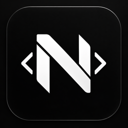
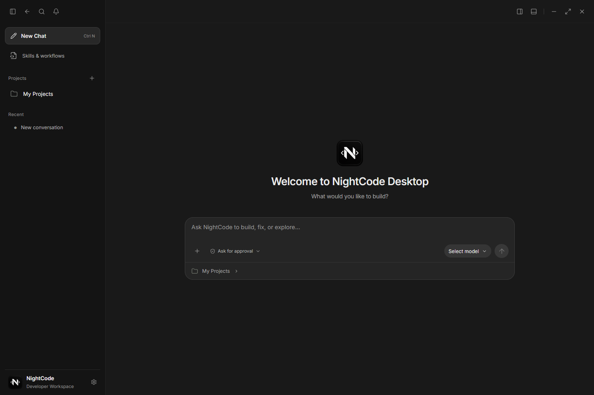
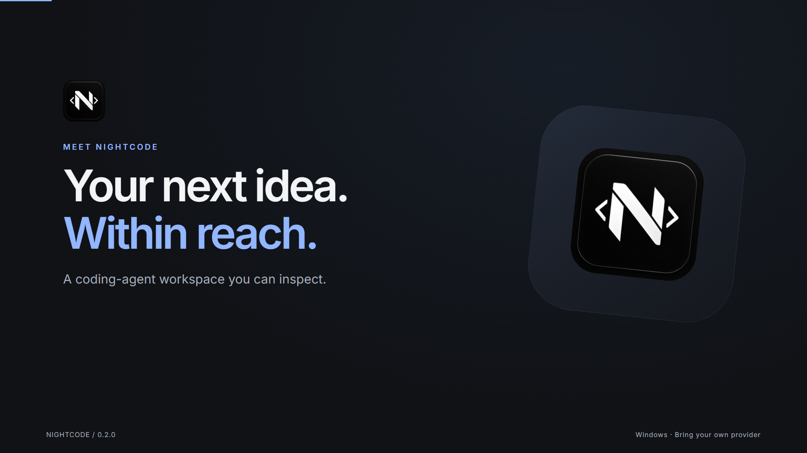
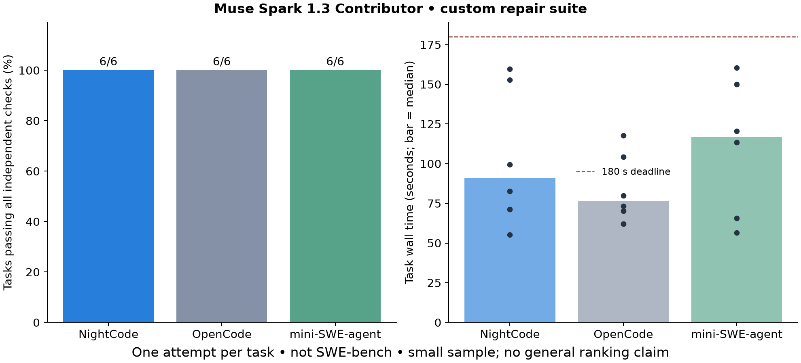
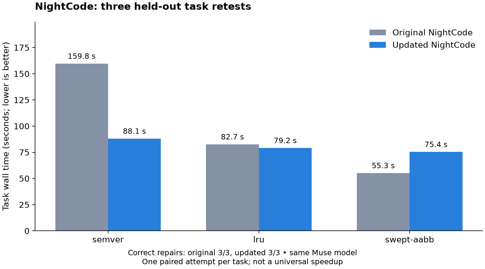

<p align="center"></p>
<h1 align="center">NightCode</h1>
<p align="center"><strong>Your models. Your projects. Work you can inspect.</strong></p>
<p align="center">A Windows desktop workspace for building software with coding agents.</p>
<p align="center"><a href="https://github.com/NightBeamStudioDEV/NightCode/releases/latest">Download for Windows</a> · <a href="#why-nightcode">Features</a> · <a href="docs/benchmarks/README.md">Benchmarks</a> · <a href="CONTRIBUTING.md">Contribute</a></p>

NightCode brings provider selection, editable plans, local tools, subagents, and verification into one workspace. Watch a task progress, review its changes, and see which checks support completion.



[](https://github.com/NightBeamStudioDEV/NightCode/releases/download/v0.2.0/NightCode-launch-1080p.mp4)

The film uses real app footage; its scripted local agent demonstration is labeled. [Editable Remotion source](marketing/README.md).

## Get started

1. Download the **Windows x64 installer** or **portable executable** from [Releases](https://github.com/NightBeamStudioDEV/NightCode/releases/latest).
2. Open Settings, connect a provider, and select a model.
3. Open your project folders and describe what you want to build.

The app includes Electron, OpenCode, and SQLite. You do not need Node.js to use it. Bring your own provider account and key. Builds are unsigned, so Windows may show a publisher warning. The portable app stores data in your Windows profile, not beside the executable.

## Why NightCode?

**See the work.** Compact tool activity, command output, progress updates, questions, and subagent status stay attached to the conversation.

**Choose your model.** Connect providers, register custom endpoints and models, and adjust reasoning where supported. Capabilities and output quality depend on your selected model.

**Make completion reviewable.** Tasks carry acceptance criteria and check records. Changes to declared inputs invalidate stale evidence. Passing checks support a completion claim; they do not replace judgment about coverage or visual quality.

**Keep control of changes.** Choose approval behavior, inspect edits, and monitor commands. Plan and Research modes are read-only through NightCode’s local tool bridge.

**Organize real projects.** Rename projects and conversations, manage multiple folders, queue prompts, and keep separate histories.

**Give agents focused guidance.** Invoke skills with `@skillname`. Bundled workflows cover browser-game architecture, gameplay, Three.js graphics, Phaser, assets, UI, performance, and QA. Add or remove your own skills as your workflow evolves.

## Built for agent workflows

| Capability | What it gives you |
| --- | --- |
| `/plan` | Explore a request and develop an approach in read-only mode |
| `/goal` | Keep an explicit objective and acceptance criteria across a conversation |
| Questions | Ask for missing requirements instead of guessing |
| Subagents | Delegate bounded exploration or file work and inspect progress |
| Verification | Run real checks, retain results, and detect stale declared inputs |
| Background commands | Start, monitor, and stop longer-running work |
| Skills | Load focused workflows on demand |

NightCode uses a pinned [OpenCode](https://opencode.ai/) engine with its own desktop UI and tool bridge. It is an independent project, unaffiliated with OpenAI or OpenCode.

## Measured, not promised

We ran **six JavaScript repair tasks against three harnesses using the same Muse Spark 1.3 Contributor model**. Each scored attempt used independent checks and a 180-second budget.

| Harness | Tasks passed | Median task time |
| --- | ---: | ---: |
| OpenCode 1.18.29 | 6/6 | 76.6 s |
| NightCode baseline | 6/6 | 91.0 s |
| mini-SWE-agent 2.4.6 | 6/6 | 116.9 s |



The results helped us improve NightCode. Three held-out retests passed before and after the changes, with **18.5% less combined elapsed time** in the updated candidate. Two tasks became faster; one became slower. Compact check responses reduced serialized evidence payloads by **65.8%**. A separate 40-task audit benchmark measured **79.8% lower median verification overhead**.



These are small, single-attempt measurements—not a general ranking, SWE-bench score, or proof of complete game quality. Setup exclusions, the corrected timeout run, task definitions, raw tables, and limitations are documented in [the benchmark report](docs/benchmarks/README.md). The updated build’s three-task retest is separate from the six-task baseline comparison.

## Privacy and permissions

- Conversations and project references are stored locally. Selected code and context go to your chosen provider.
- Keys use Electron’s encrypted credential storage. Conversation and command history are not encrypted by NightCode.
- NightCode adds no telemetry service, required NightCode account, or automatic updater. Providers and the underlying engine may make network requests during operation.
- **This is not an OS sandbox.** Approved commands run with your Windows permissions. Full access automatically approves local actions; use it only for work you trust.

| Permission mode | Behavior |
| --- | --- |
| Ask for approval | Review mutations, commands, and external path access |
| Approve for me | Accept eligible project edits and narrowly allowed read-only commands; ask for other actions |
| Full access | Accept local actions automatically and retain their history |

Data lives in `%APPDATA%/nightcode-desktop`. Billing, availability, and rate limits are controlled by your provider. Never put credentials into public issues or screenshots.

## Build from source

Use Windows x64, Node.js 22 or newer, and npm. Git Bash is useful for projects whose commands expect Bash.

```powershell
npm ci
npm start
```

```powershell
npm test             # Unit tests
npm run test:e2e     # Electron + OpenCode integration tests
npm run package     # Windows installer and portable executable
npm run verify:package
npm run smoke:package
```

Integration tests use isolated local model fixtures and do not spend provider credits. See [CONTRIBUTING.md](CONTRIBUTING.md) for the architecture and workflow.

## Project status

Version 0.2.0 targets Windows x64. macOS/Linux packages, signed distribution, provider OAuth, cloud sync, and a third-party plugin marketplace are not included. Reasoning displays only what the provider exposes; they cannot reveal private internal reasoning. Throughput estimates are labeled when authoritative usage is unavailable.

[Report an issue](https://github.com/NightBeamStudioDEV/NightCode/issues) with a reproducible example and redacted logs.

## License

[MIT](LICENSE). Dependencies retain their own licenses; see [third-party notices](THIRD_PARTY_NOTICES.md).
