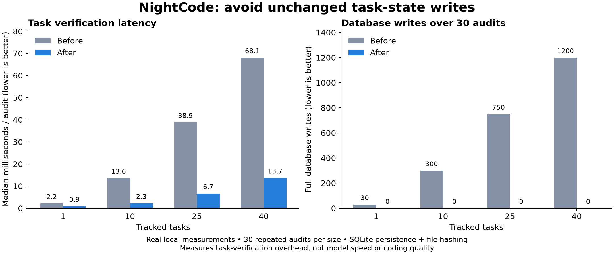

# Benchmark methodology and results

Measured on Windows x64, September 8, 2026. These are six small synthetic JavaScript repairs, not SWE-bench or a complete game-development benchmark.

## Same-model comparison

Each harness used Muse Spark 1.3 Contributor through OpenCode Go, with xhigh reasoning requested. Fresh task directories contained the same specification, buggy source, and public smoke test. Six independent check groups per task ran outside the agent workspace. Correctness required passing all groups and leaving the public smoke test unchanged. Separation was logical, not an OS sandbox.

| Harness | Correct | Median task time |
| --- | ---: | ---: |
| NightCode baseline, 0.2.0 | 6/6 | 91.0 s |
| OpenCode native build agent, 1.18.29 | 6/6 | 76.6 s |
| mini-SWE-agent, 2.4.6 | 6/6 | 116.9 s |

See [measured rows](results.csv) and [task specifications and grading assertions](tasks.cjs). Tasks cover clamp, asynchronous retry, CSV, SemVer, LRU/TTL, and swept AABB collision. All scored runs completed within 180 seconds. Framework tool errors and nonzero shell exits are different measurements and are not compared as failure rates.

NightCode used the real packaged tool bridge. OpenCode used native tools. mini-SWE-agent used upstream DefaultAgent, mini.yaml, the Responses API adapter, and Git Bash on Windows. Its provider configuration supplied the [required session and user-agent headers](https://opencode.ai/docs/go/#where-can-i-use-it). mini timings include Python import startup; engine startup was outside the other timers. These are observed task times, not isolated model throughput.

## Exclusions and order

The main run rotated harness order by task. An initial driver preflight was excluded in full. In the main raw run, mini clamp used an incompatible API endpoint and mini retry lacked routing headers; neither edited the task. Both were rerun after correcting setup. The original mini LRU run completed correctly in 184.892 seconds under an incorrectly generous 200-second watchdog. Its replacement used the strict 180-second deadline and completed in 150.103 seconds. These three supplemental runs occurred afterward. No incorrect implementation was discarded to improve scores.

Private profile directories, credentials, conversation traces, and generated task outputs are excluded from this public repository. The public table retains source-run identifiers and all selected scores.

## Improvements

The candidate was frozen before observing held-out baseline results. Changes skipped unchanged database writes, compacted model-facing check history while retaining evidence, and encouraged batching meaningful assertions and reusing current checks.

| Held-out task | Baseline | Updated | Correct before / after |
| --- | ---: | ---: | --- |
| SemVer | 159.753 s | 88.106 s | Yes / Yes |
| LRU/TTL | 82.707 s | 79.216 s | Yes / Yes |
| Swept AABB | 55.265 s | 75.443 s | Yes / Yes |

Combined time decreased 18.5%; median decreased 4.2%. One task became slower. [Paired data](heldout.json). The final release additionally preserves access to older evidence after the recent-command cache expires; that branch was added after the live retest and verified with retention/session-isolation assertions.

Actual serialized task responses decreased from 54,525 to 18,660 UTF-8 bytes (65.8%). This is payload size, not tokens. A separate real SQL.js/file-hashing workload, with 30 unchanged audits per size, measured a 40-task median decrease from 68.106 to 13.725 ms and 1,200 fewer full database writes. [Before](audit-before.json) · [After](audit-after.json).

## Limits

One attempt per task, six tasks, one workstation, and sequential provider requests do not establish a statistically reliable ranking. Cache effects, model nondeterminism, and machine load affect timing. Check groups are correlated. Nothing here establishes superiority on repository-scale changes, complete 3D games, graphics, security, or long-running autonomy. The six-task comparison uses the original NightCode; the updated candidate has a separate three-task retest.

[SWE-bench](https://www.swebench.com/) and [Terminal-Bench](https://www.tbench.ai/) use different tasks and environments. Their leaderboard scores should not be mixed with these measurements.
